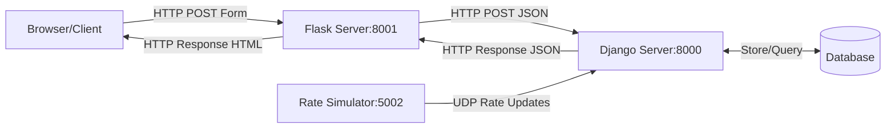

# Currency Converter Network Project

A distributed system for currency conversion with real-time rate updates, demonstrating TCP/HTTP and UDP network communications.

## Features

- Real-time currency conversion
- Live exchange rate updates via UDP
- Web interface for currency conversion
- Support for multiple currencies (USD, EUR, GBP, TRY)
- Historical rate tracking

## System Components

- **Flask HTTP Server (8001)**: Web interface and form handling
- **Django Application Server (8000)**: Business logic and rate processing
- **Rate Simulator (5002)**: Real-time rate updates via UDP
- **Database**: Stores currencies and exchange rates


## Running the Application

1. Start the Django server:
```bash
python manage.py runserver
```

2. Start the Flask server:
```bash
python http_server/server.py
```

3. Start the Rate Simulator:
```bash
python rate_simulator/simulator.py
```

4. Open your browser and navigate to:
```
http://localhost:8001
```

## Project Structure

```
network-task/
├── manage.py                 # Django management script
├── network_project/         # Django project configuration
├── currency_converter/      # Currency conversion app
├── rate_simulator/         # Rate simulation module
├── http_server/            # Flask web server
└── venv/                   # Virtual environment
```

## Network Flow

1. **Web Interface (TCP/HTTP)**
   - Browser → Flask (8001): Form submission
   - Flask → Django (8000): API requests
   - Django → Flask: JSON responses
   - Flask → Browser: HTML responses

2. **Rate Updates (UDP)**
   - Rate Simulator → Django (5002): Real-time updates

## Monitoring

Monitor network traffic using:
```bash
# TCP/HTTP traffic
sudo tcpdump -i lo0 port 8000 or port 8001

# UDP traffic
sudo tcpdump -i lo0 port 5002
```


## Network Flow
